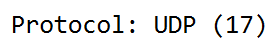
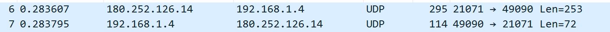

Achmad Khosyi' Assajjad Ramandanta

5025211007

Jarkom (D)

## TCP
### No 1

IP : 192.168.206.171
Port : 65415

### No 2

IP : 128.119.245.12
Port : 80

### No 3

Sequence Number (raw) : 385768711

### No 4

Sequence Number (raw) : 2588908788
Acknowledgment Number (raw) : 385768712

### No 5

Sequence Number (raw) : 1533916408
TCP Payload : 1311 bytes

### No 6

### No 7

### No 8

### No 9

### No 10

### No 11

### No 12

### No 13

### No 14

### No 15

## UDP

### No 1

Packet Number : 19

4 Fields : Source Port, Destination Port, Length, Checksum

### No 2

Panjang masing-masing UDP Header adalah 8 bytes dengan masing-masing ukuran field 2 bytes (16 bit).

### No 3

Header + Data = 33 + 8 = 41

### No 4

Panjangnya adalah 16-bit dan nilai maksimumnya adalah 65.535 serta ukuran headernya adalah 8 byte, maka payload maksimumnya adalah 65.527 byte.

### No 5

(2^16 – 1) = 65535

### No 6

Protocol: UDP (17)

### No 7

First Packet = 6
Second Packet = 7

IP dari source packet pertama adalah IP dari destination packet kedua.
