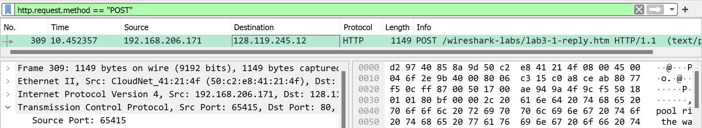
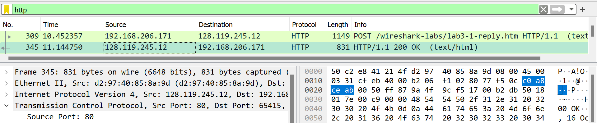
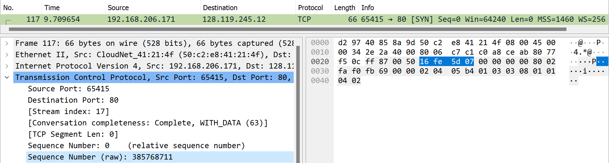
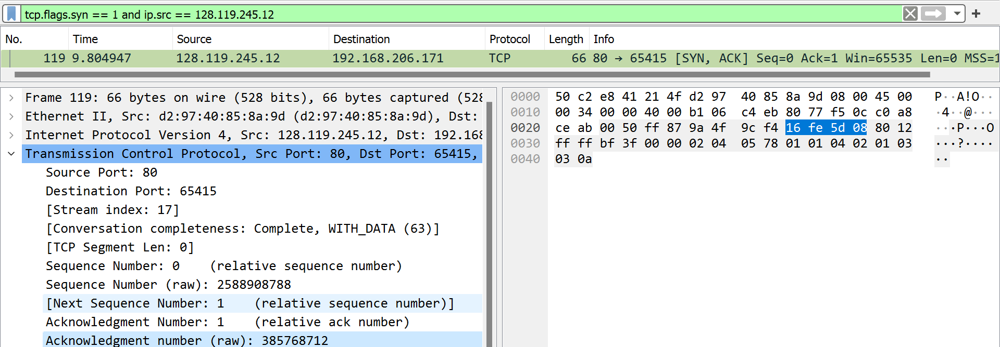
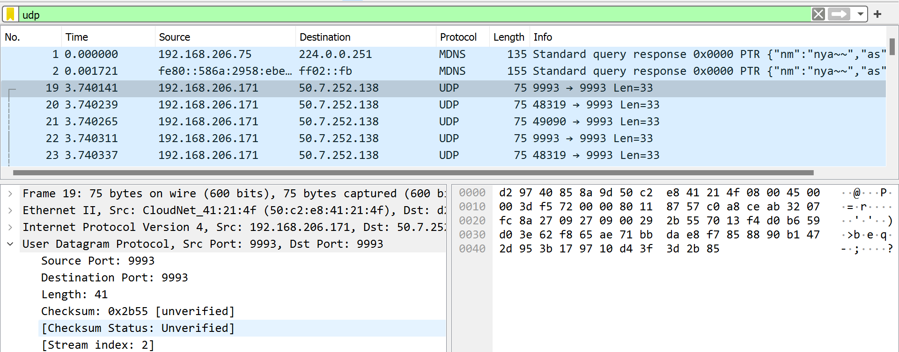
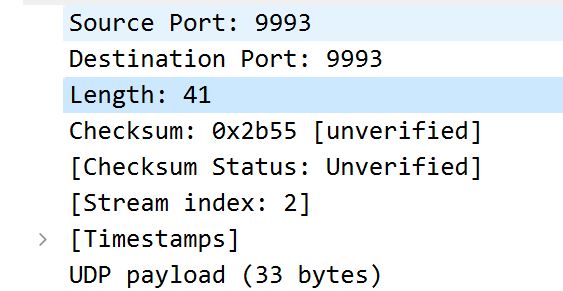

Achmad Khosyi' Assajjad Ramandanta

5025211007

Jarkom (D)

## TCP
### No 1

IP : 192.168.206.171
Port : 65415

### No 2

IP : 128.119.245.12
Port : 80

### No 3

Sequence Number (raw) : 385768711

### No 4

Sequence Number (raw) : 2588908788
Acknowledgment Number (raw) : 385768712

### No 5

## UDP

### No 1

Packet Number : 19

4 Fields : Source Port, Destination Port, Length, Checksum

### No 2

Panjang total UDP Header adalah 8 bytes dengan masing-masing 2 bytes.

### No 3

Header + Data = 33 + 8 = 41
